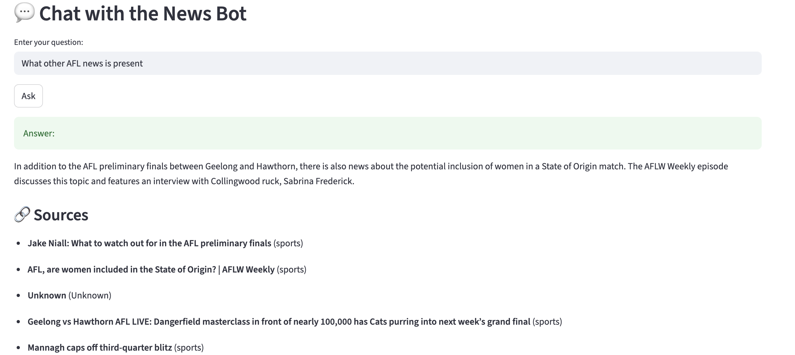

# AI Powered News Aggregation Chatbot

## Summary

This project is an AI-powered news aggregation system designed to automatically extract news articles from multiple Australian news outlets, categorize and summarize them, and present the most important stories as daily highlights in a user-friendly interface.  

In addition, it features an interactive chatbot built with Retrieval-Augmented Generation (RAG), enabling users to ask questions about the daily highlights and receive context-aware answers. The system combines news scraping, intelligent categorization, summarization, and conversational AI to deliver a streamlined and engaging way to stay updated on current events.  


## Features

- Fetches news articles from configured RSS feeds
- Categorizes news articles into topics (sports, finance, politics, lifestyle, music)
- Detects and groups similar news stories to reduce redundancy
- Identifies the most important news stories based on priority scoring  
- Stores articles and metadata in a dataset folder  
- Indexes articles using FAISS (a vector database) for semantic querying  
- Provides a chat interface allowing users to ask questions about the news (e.g. summaries, clarifications)  
- Simple UI built with Streamlit for easy interaction  

---

## Architecture & Components

Here are the key components of the project:

| Component | Purpose |
|---|---|
| **RSS_NEWS_FEED/** | Contains scripts and logic for fetching news via RSS feeds |
| **datasets/** | Storage for raw news articles, metadata, etc. |
| **faiss_store/** | Holds the FAISS index used for semantic search over news content |
| **rag/** | Contains Retrieval-Augmented Generation logic |
| **streamlitapp.py** | Main application file that runs the chatbot UI with Streamlit |
| **config.py** | Configuration file (RSS feed URLs, API keys, paths, etc.) |
| **requirements.txt** | Python dependencies needed for the project |
| **images/** | Contains any images used (logos/screenshots) |
| **app.log** | Log file to capture runtime logs/errors |

---

## UI card


## Installation

1. **Clone the repository**

   ```bash
   git clone https://github.com/ashith-b/AI_Powered_News_Aggregation_Chatbot.git
   cd AI_Powered_News_Aggregation_Chatbot
   ```

2. **Set up a Python virtual environment**

   ```bash
   python3 -m venv venv
   source venv/bin/activate
   ```

3. **Install dependencies**

   ```bash
   pip install -r requirements.txt
   ```
5. **Scraping of news articles**

   ```bash
   python RSS_NEWS_FEED/data_scrapping.py
   ```

5. **Install dependencies**

   ```bash
   Streamlit run streamlitapp.py 
   ```